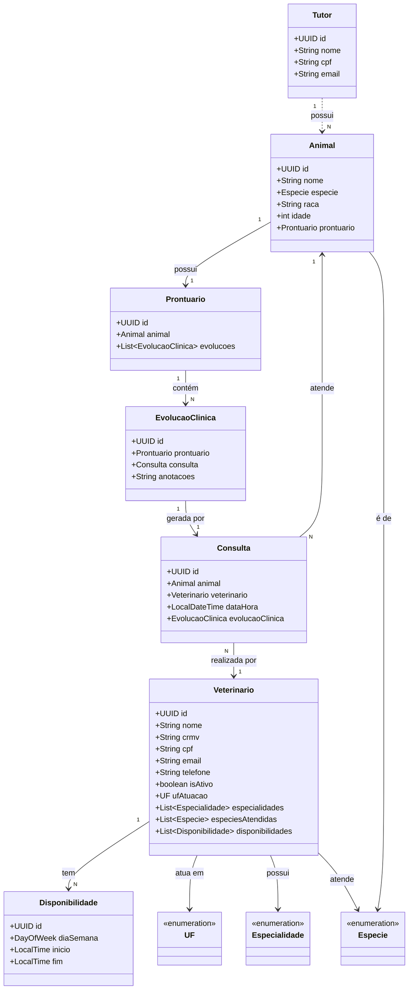

```mermaid
classDiagram
  class Veterinario {
    +UUID id
    +String nome
    +String crmv
    +String cpf
    +String email
    +String telefone
    +boolean isAtivo
    +UF ufAtuacao
    +List~Especialidade~ especialidades
    +List~Especie~ especiesAtendidas
    +List~Disponibilidade~ disponibilidades
  }

  class Tutor {
    +UUID id
    +String nome
    +String cpf
    +String email
  }

  class Animal {
    +UUID id
    +String nome
    +Especie especie
    +String raca
    +int idade
    +Prontuario prontuario
  }

  class Prontuario {
    +UUID id
    +Animal animal
    +List~EvolucaoClinica~ evolucoes
  }

  class EvolucaoClinica {
    +UUID id
    +Prontuario prontuario
    +Consulta consulta
    +String anotacoes
  }

  class Consulta {
    +UUID id
    +Animal animal
    +Veterinario veterinario
    +LocalDateTime dataHora
    +EvolucaoClinica evolucaoClinica
  }

  class Disponibilidade {
    +UUID id
    +DayOfWeek diaSemana
    +LocalTime inicio
    +LocalTime fim
  }

  class Especialidade {
    <<enumeration>>
  }

  class Especie {
    <<enumeration>>
  }

  class UF {
    <<enumeration>>
  }

  Tutor "1" ..> "N" Animal : possui

  Animal "1" --> "1" Prontuario : possui
  Prontuario "1" --> "N" EvolucaoClinica : contém
  EvolucaoClinica "1" --> "1" Consulta : gerada por
  Consulta "N" --> "1" Animal : atende
  Consulta "N" --> "1" Veterinario : realizada por
  Veterinario "1" --> "N" Disponibilidade : tem
  Veterinario --> UF : atua em
  Veterinario --> Especialidade : possui
  Veterinario --> Especie : atende
  Animal --> Especie : é de
```